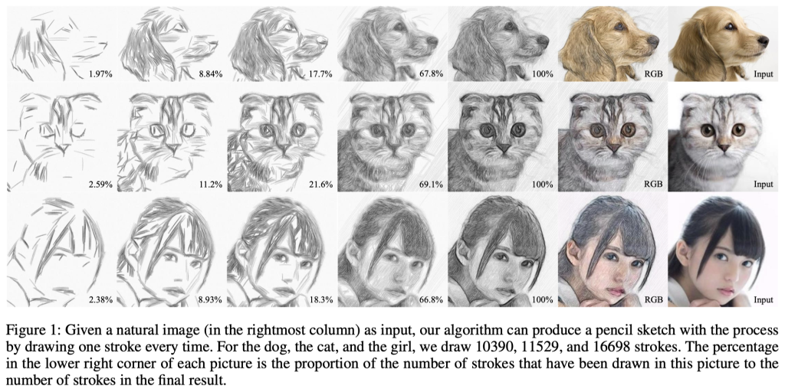
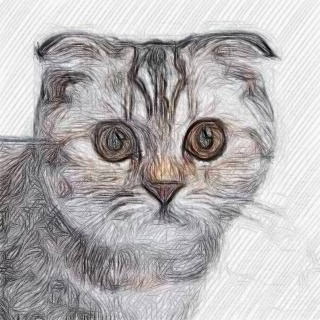
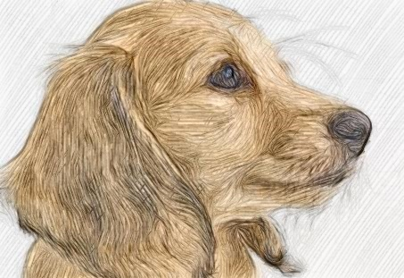
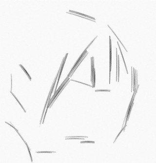
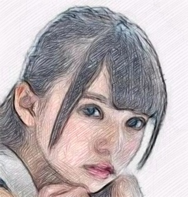
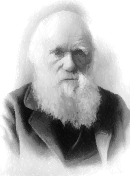
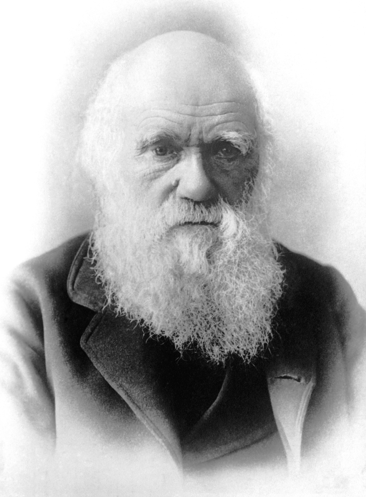

# Robot Drawing System

## I. Introduction

The **robotic drawing system** is an interdisciplinary field that combines computer vision, machine learning, and robotics to create advanced systems capable of generating artistic and realistic drawings. These systems have a wide range of applications, including entertainment, artistic expression, design, education, and medical visualization. The development of such systems involves integrating several essential components, including **edge detection, semantic segmentation, object detection models, and stroke generation techniques**.

## II. Edge Detection in Robotic Drawing Systems

Edge detection is a critical aspect of robotic drawing systems, as it helps identify the contours of objects within an image, providing the foundational structure for the drawing. By incorporating advanced edge detection techniques, a robotic drawing system can generate drawings with a higher level of detail and accuracy. A notable work in this area is by Ke et al., who present **MODNet**, a trimap-free, semantic-aware human image matting approach that leverages semantic segmentation to improve edge detection and object boundaries in portrait images.

## III. Semantic Segmentation and Object Detection Models

Semantic segmentation and object detection models are crucial for robotic drawing systems, as they enable the system to recognize, localize, and understand the context and relationships between different objects within an image accurately. A groundbreaking model in this area is the **Segment Anything Model (SAM)** by Kirillov et al. SAM is a versatile image segmentation model that combines the benefits of both interactive and automatic segmentation approaches, making it highly adaptable for various segmentation tasks. SAM is trained on a diverse and high-quality dataset, enabling it to generalize to new objects and images that it hasn't encountered during training.

## IV. Stroke Generation Techniques

Stroke generation techniques are essential aspects of advanced robotic drawing systems, as they determine the artistic style and overall quality of the generated drawings. Tong et al. present a novel **image-to-pencil translation method** that generates high-quality pencil sketches by drawing one stroke at a time, guided by vector flow and grayscale information. Another study by Adamik et al. introduces a **general robotic system for creating realistic pencil drawings** using image evolution and genetic algorithms, which employs simple line segments for image approximation, resulting in aesthetic and fast drawings.

## V. Developing an Advanced Robotic Drawing System

1. **Dataset Preparation**: Collect a diverse dataset of images to serve as input for the stroke generation model, ensuring the dataset includes a wide range of subjects, styles, and complexities.

2. **Preprocessing of Input Images**: Implement a preprocessing pipeline to convert input images into a suitable format for the transformer-based encoder, such as tokenization and feature extraction using a pre-trained image feature extractor.

3. **Edge Detection**: Apply advanced edge detection algorithms to identify the contours of objects within the input images, providing the foundational structure for the drawing.

4. **Integration of SAM**: Incorporate the Segment Anything Model (SAM) into the stroke generation pipeline for semantic segmentation and object detection, providing additional context and guidance for the stroke generation process.

5. **Design and Implementation of Transformer-based VAE**: Develop a VAE model with a transformer-based encoder and decoder architecture for unsupervised learning of stroke generation from input images, where the encoder generates latent space representations and the decoder reconstructs stroke sequences from these representations.

6. **Contour Stroke Generation**: Modify the VAE model to prioritize the generation of contour strokes before completing the sketch, incorporating additional loss terms in the custom loss function to focus on the sequence of strokes and the distinction between contour and internal strokes.

7. **Loss Function and Model Training**: Define a custom loss function for the VAE that incorporates the reconstruction loss, the Kullback-Leibler (KL) divergence loss, and the additional contour stroke prioritization loss. Compile the VAE model with an optimizer

## References

### [Sketch Generation with Drawing Process Guided by Vector Flow and Grayscale](https://github.com/TZYSJTU/Sketch-Generation-with-Drawing-Process-Guided-by-Vector-Flow-and-Grayscale)

::::{grid} 2

:::{grid-item}
Image Evolution
:::
:::{grid-item}
Final generated image (RGB)
:::
:::{grid-item}

:::
:::{grid-item}

:::
:::{grid-item}

:::
:::{grid-item}

:::
:::{grid-item}

:::
:::{grid-item}

:::
::::

### [Fast Robotic Pencil Drawing](https://github.com/xgoga/FastRoboticPencilDrawing)

::::{grid} 3

:::{grid-item}
Image Evolution
:::
:::{grid-item}
Final generated image
:::
:::{grid-item}
Original template
:::
:::{grid-item}

:::
:::{grid-item}

:::
:::{grid-item}

:::
:::{grid-item}

:::
:::{grid-item}

:::
:::{grid-item}

:::
:::{grid-item}

:::
:::{grid-item}

:::
:::{grid-item}

:::
:::{grid-item}

:::
:::{grid-item}

:::
:::{grid-item}

:::
::::
