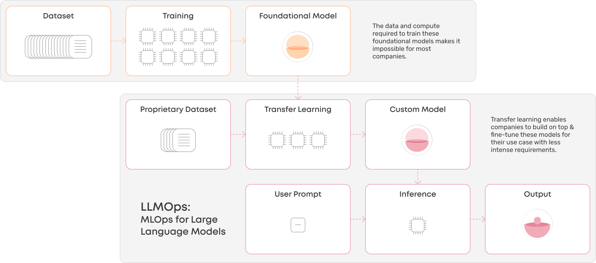

# LLMOps

source: [valohai](https://valohai.com/blog/llmops/)

## Introduction

Large Language Model Operations (LLMOps) is a sub-category of MLOps that focuses on the operational capabilities and infrastructure required to fine-tune, deploy, and manage Large Language Models (LLMs) in production environments. LLMOps addresses the unique challenges and requirements associated with deploying, maintaining, and scaling LLMs, such as GPT-3, which have significantly more parameters and computational requirements than traditional ML models.

## Key Components of LLMOps

### Infrastructure for Fine-Tuning LLMs

The fine-tuning process for LLMs involves adjusting model parameters on smaller, domain-specific datasets to enhance performance on specific tasks or domains. This process requires GPU machines capable of handling large datasets and parallel processing. LLMOps infrastructure should provide:

- a. Scalable compute resources: Access to powerful GPU clusters to handle the fine-tuning process for LLMs.

- b. Data storage and management: Efficient storage and retrieval systems for handling large datasets used in the fine-tuning process.

### Deployment and Inference for LLMs

Deploying LLMs requires significant computational resources and, in some cases, a chain of models and other safeguards to produce the best possible output for the end user. Key considerations for deploying and managing LLMs in production include:

- a. Model deployment strategies: Techniques such as model quantization, pruning, and distillation can help reduce model size and improve deployment efficiency.

- b. Resource allocation: Dynamic allocation and auto-scaling of computational resources based on workload and requirements.

### Model Monitoring and Maintenance

Monitoring and maintaining LLMs in production environments involve tracking performance metrics, detecting biases, and updating models to ensure optimal performance. Key components include:

- a. Performance metrics tracking: Monitor accuracy, recall, precision, and F1-score to assess the model's performance on various tasks.

- b. Model drift detection: Monitor how the model's performance changes over time as the distribution of data shifts, and retrain or fine-tune the model as needed.

- c. Bias detection and mitigation: Use fairness metrics and other techniques to identify and address potential biases in the model's predictions.

### LLMOps Landscape

The LLMOps landscape can be broadly categorized into:

- a. Platforms for fine-tuning, versioning, and deploying LLMs: These platforms handle the infrastructure, making it easier to work with LLMs.

- b. No-code and low-code platforms: Designed specifically for LLMs, these platforms offer high abstraction layers for easy adoption but limited flexibility.

- c. Code-first platforms: Built for custom ML systems, including LLMs, these platforms offer high flexibility and easy access to compute resources for expert users.

- d. Frameworks: Tools that standardize interfaces between different LLMs, streamline prompt management, and simplify the development of LLM applications.

- e. Ancillary tools: These tools focus on specific parts of the workflow, such as testing prompts, incorporating human feedback, or evaluating datasets.

## Best Practices for LLMOps

### Collaboration

A successful LLMOps implementation requires collaboration between data scientists, ML engineers, and domain experts to design, train, deploy, and evaluate LLM-based applications.

### Continuous Integration and Deployment (CI/CD)

Implement CI/CD pipelines to maintain the performance and relevance of LLMs by automatically retraining, validating, and deploying updated models.

### Responsible AI Principles

Adopt responsible AI principles, such as transparency, fairness, and accountability, to ensure the ethical use of LLMs in production environments.

### Security and Compliance

Address security and compliance concerns by ensuring data privacy, model confidentiality, and access control:

- a. Data Privacy: Comply with data protection regulations like GDPR and securely store and process sensitive data.

- b. Model Confidentiality: Protect the intellectual property of the LLM by implementing access controls and encrypting model parameters.

- c. Access Control: Implement role-based access control to limit access to the LLM and its associated resources, reducing the risk of unauthorized access or misuse.

## Conclusion

LLMOps is a critical aspect of successfully deploying and managing Large Language Models in production environments. By addressing the unique challenges associated with LLMs and implementing best practices, organizations can effectively harness the power of LLMs and maintain their performance in real-world applications. While the term LLMOps might not have staying power as a separate entity, its emergence highlights the rapid evolution of ML and the increasing importance of addressing the specific requirements of LLMs in operations and infrastructure.
